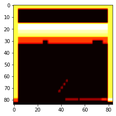
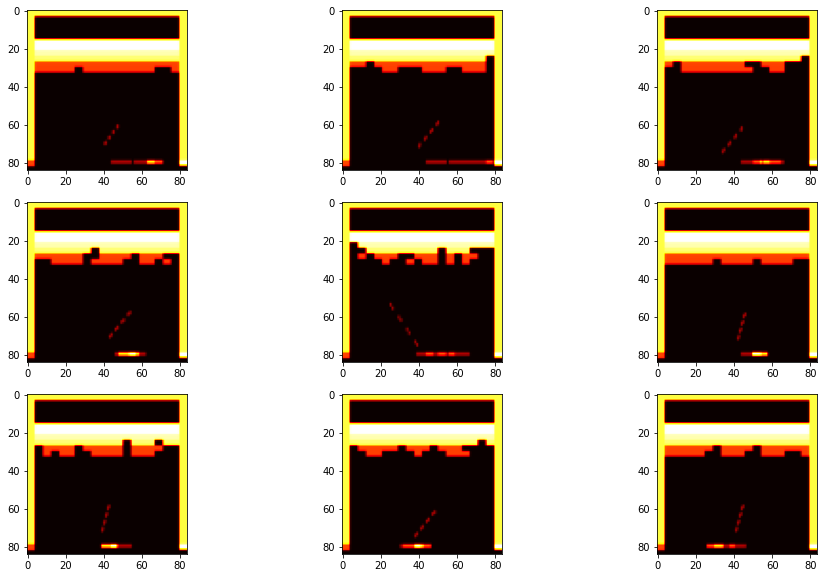
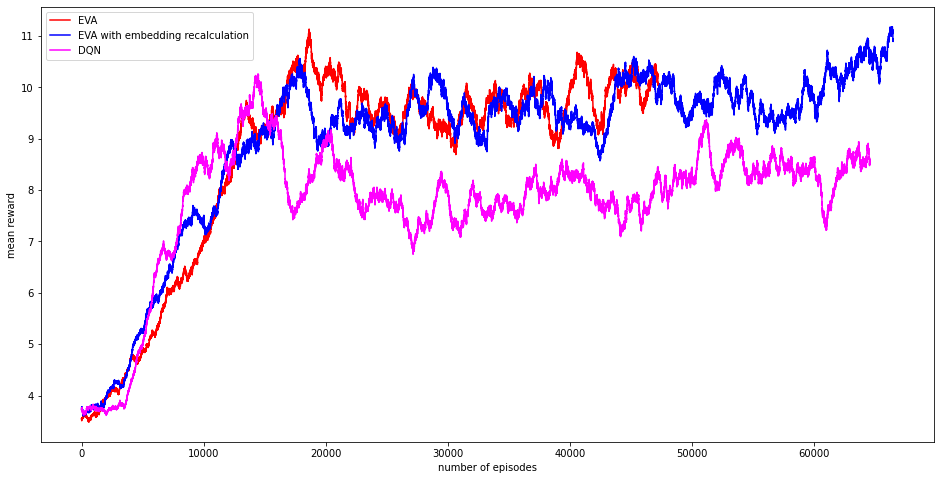

# Ephemeral Value Adjustment

This repository contains an implementation of Ephemeral Value Adjustment (EVA) from "Fast deep reinforcement learning using online adjustments from the past" by S.Hansen et al. https://arxiv.org/abs/1810.08163 </br>
Project is done as part of the course <a href="http://deeppavlov.ai">DeepPavlov </a> course: <a href="http://deeppavlov.ai/rl_course_2020"> Advanced Topics in Deep Reinforcement learning </a>. 

#### <a href="https://github.com/amfolity/">Anna Mazur</a>, <a href="https://github.com/darthrevenge">Nikita Trukhanov</a>

### Prerequisites
We used PyTorch library version 1.6.</br>
For performing approximate nearest neighbours search we used Fast Library for Approximate Nearest Neighbors (FLANN).
Original codes and install instructions could be found https://github.com/mariusmuja/flann.

### Running the code

In order to run the code with the default parameters use the snippet below. The default parameters can be found in the module config.py in our repository.

```sh
python experiment.py
```

In order to run baseline DQN model one can set up weighting parameter &lambda; to 1

```sh
python experiment.py --lambd=1
```

### Parameters and some differences from the original article
We ran experiments primarly on atari environments, such as "BreakoutNoFrameskip-v4" and "AtlantisNoFrameskip-v4". We used EpisodicLifeEnv, FireReset or NoOpReset and MaxAndSkipEnv wrappers from OpenAI.baselines. We did not use four parallel agents like in original work. We also limit the size of experience replay to 400k. Other than that, we tweeked a little bit some parameters: greedy exploration rate (&varepsilon;) decay rate, Adam learning rate. Most of the parameters were kept the same as in the original work (Section 9 Atari Experiment Details).</br>
### Trajectory Central Planning details
Trajectory Central Planning (TCP) algorithm is a core of Ephemeral Value Adjustment. The idea behind it is to find some states in past experience that are in some sence similar to the given state. Similarity here is defined by measuring Euclidean distance in embedding space. Embeddings here are the outputs of fully-connected layer of the convolutional neural network used by agent. Ideally, once the network is good enough in predicting Q-values, the embeddings for the states similar in terms of further actions and rewards become close in space.</br>
TCP unrolls several paths from the experience, starting from these similar states, and calculates the action values, based on actual rewards on-path, and on Q-values estimates by agent's neural network off-path. These non-parametric Q-values, as they called in the original work, are stored in the value buffer along with the embedding of the state they were calculated for.</br>
We implemented two different version of TCP &ndash; as it was not explicitly stated in the original work what embeddings should be inserted as the keys to the value buffer. As the neural network changing over time, the embeddings for the states that were found as nearest to the given one would not be quite the same. There are two possibilities: use the old embeddings which we used to find the similar states as the keys to insert in the value buffer, or obtain new embeddings by passing these states into neural network and use them. We did not notice any significant difference between these two variants in our experiments. Currently, the latest version of the code uses the first variant.
#### Embeddings
After some time during the learning when the agent could play reasonably well we paused learning process to check how well searching neighbours in the embedding space works.
We took a frame in the Breakout game and made a request to replay buffer to yield its neighbors in the embedding space using approximate nearest neighbours search we mentioned above.</br></br>

</br>*Query state* </br></br>

</br>*Neighboring states* </br></br>
You can see that the position and direction of the ball and the position of the bar are similar in most cases, but the remaining blocks are different. It would be hard to achieve the same in the original frames space.


### Results
As a benchmark we have used DQN of exactly the same atchitecture and hyperparameters. The only difference is that in DQN, weighting parameter for non-parametric Q-value, &lambda;, equals 1. </br>

Below is a video of how EVA algorithm plays on Breakout environment after 10000 episodes </br></br>

</br>*Movie of Breakout play game after 10000 episodes* </br></br>
 
Below is a moving average (window of 1000 episodes) of training rewards of two implementations of TCP (described in TCP section above) and DNQ with the same hyperparameters on Atlantis environment.</br></br>

</br>*Moving average of training rewards for Atlantis* </br></br>
